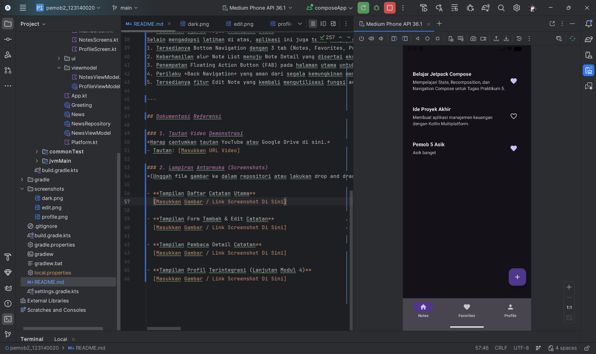
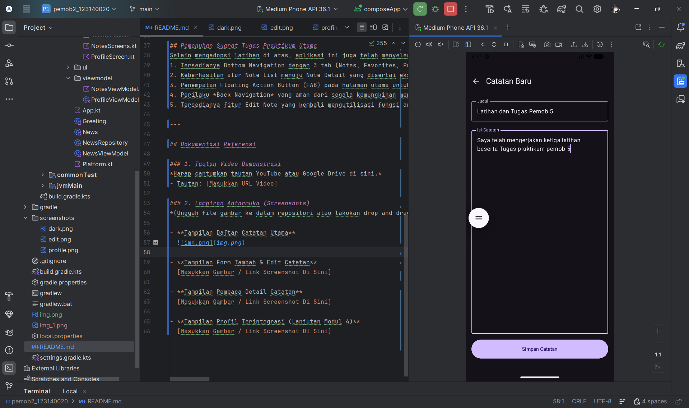
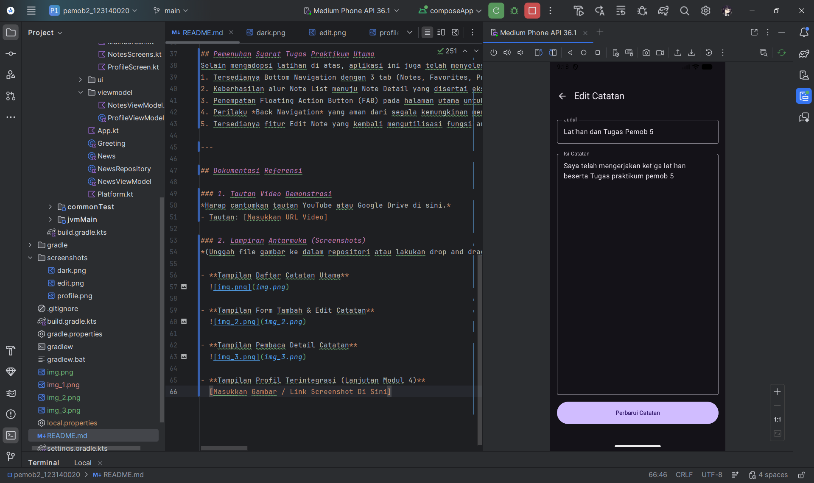
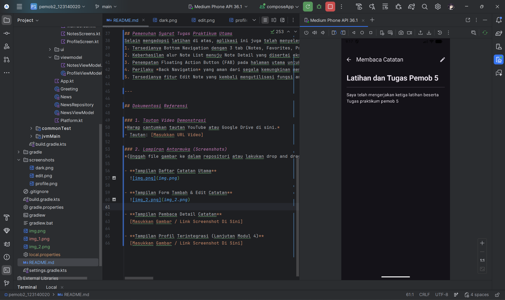
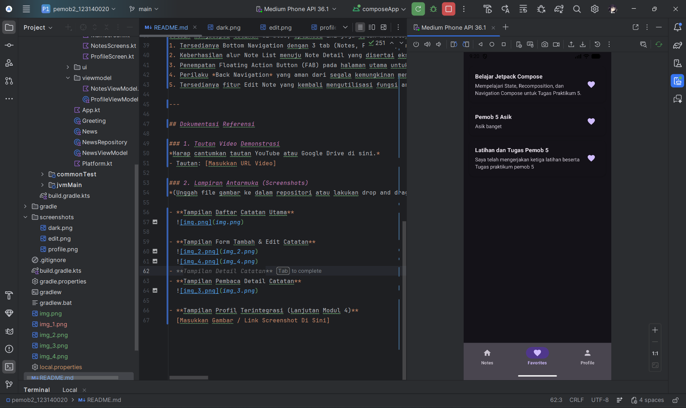
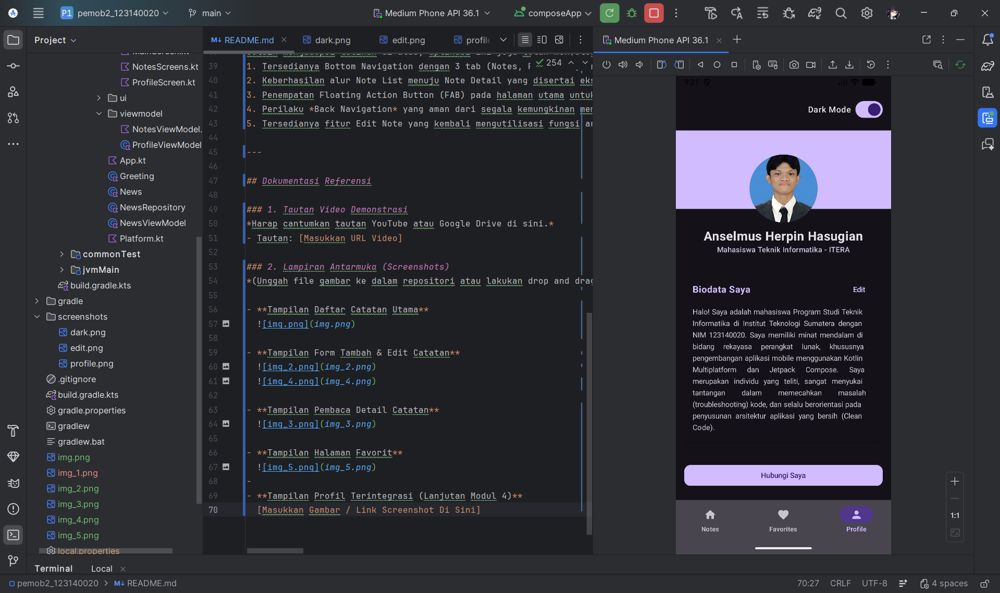

# Tugas Praktikum 5 - Multi-Screen Navigation App

**Nama:** Anselmus Herpin Hasugian  
**NIM:** 123140020

## Deskripsi Proyek
Proyek ini merupakan implementasi arsitektur Navigation Component pada Kotlin Multiplatform (KMP). Aplikasi ini dikembangkan untuk mendemonstrasikan kapabilitas perpindahan antar layar (routing), mekanisme pengiriman data statis antar layar (arguments), serta penggunaan Bottom Navigation yang dipadukan dengan pemisahan lapisan logika menggunakan pola MVVM (Model-View-ViewModel).

---

## Pemenuhan Kriteria Latihan Modul
Pendekatan pengembangan aplikasi ini secara langsung mengintegrasikan Latihan 1, 2, dan 3 menjadi satu kesatuan arsitektur (Single Activity, Multiple Screens). Berikut adalah rincian pemenuhan *checklist* dari modul pada struktur kode yang telah diunggah:

### Latihan 1: Navigasi Dasar
[cite_start]Seluruh kriteria Latihan 1 telah terpenuhi secara fungsional [cite: 389-395]:
- [x] **Setup NavController & NavHost:** Diimplementasikan pada file `MainScreen.kt` menggunakan fungsi `rememberNavController()` sebagai sentral pengatur rute.
- [x] **HomeScreen dengan Button & navigate() ke detail:** Diterapkan melalui komponen antarmuka `NoteListScreen` yang menggunakan fungsi *callback* navigasi untuk memicu metode `.navigate()`.
- [x] **DetailScreen dengan Button & popBackStack() ke home:** Diterapkan melalui `TopAppBar` pada `NoteDetailScreen` dan `AddNoteScreen` di mana fungsi `popBackStack()` dipanggil secara aman.

### Latihan 2: Navigasi dengan Argument
[cite_start]Seluruh kriteria Latihan 2 telah dirangkai pada alur kerja detail catatan [cite: 409-419]:
- [x] **Sealed class untuk routes:** Diimplementasikan secara terpusat pada file `navigation/Routes.kt` (Kelas `Screen`).
- [x] **Route dengan {noteId} & navArgument setup:** Dikonfigurasi di dalam `NavHost` pada file `MainScreen.kt` dengan mendeklarasikan argumen melalui fungsi `navArgument("noteId")` bertipe `NavType.IntType`.
- [x] **NoteListScreen dengan clickable list items:** Diimplementasikan menggunakan `Modifier.clickable` pada `ElevatedCard` yang membungkus setiap item catatan.
- [x] **navigate dengan noteId & NoteDetailScreen menampilkan noteId:** Berhasil mengekstraksi parameter menggunakan instruksi `backStackEntry.arguments?.getInt("noteId")` yang kemudian diteruskan sebagai *state* statis ke antarmuka pembaca.

### Latihan 3: Bottom Navigation
[cite_start]Seluruh kriteria Latihan 3 telah diintegrasikan pada kerangka utama aplikasi [cite: 447-451]:
- [x] **BottomNavItem sealed class:** Dideklarasikan dalam `navigation/Routes.kt`.
- [x] **NavigationBar & NavigationBarItem:** Diabstraksi dalam komponen modular `AppBottomNavigationBar.kt` agar struktur kode tetap bersih.
- [x] **currentBackStackEntry untuk selected state:** Menggunakan observasi *state back stack entry* untuk menyoroti tab aktif secara presisi.
- [x] **Scaffold dengan bottomBar & NavHost di content:** Logika `Scaffold` dideklarasikan pada `MainScreen.kt`, dilengkapi dengan fungsi penyembunyian bar bawah (*Auto-Hide*) secara dinamis.
- [x] **3 screen composables & Test tab switching:** Mencakup integrasi layar Notes, Favorites, dan Profile yang telah dipisahkan ke dalam folder `screens`.

---

## Pemenuhan Syarat Tugas Praktikum Utama
Selain mengadopsi latihan di atas, aplikasi ini juga telah menyelesaikan seluruh spesifikasi akhir tugas:
1. Tersedianya Bottom Navigation dengan 3 tab (Notes, Favorites, Profile) yang stabil.
2. Keberhasilan alur Note List menuju Note Detail yang disertai ekstraksi *Required Arguments*.
3. Penempatan Floating Action Button (FAB) pada halaman utama untuk mengakses layar penambahan entri baru.
4. Perilaku *Back Navigation* yang aman dari segala kemungkinan memori *stack* yang tumpang tindih.
5. Tersedianya fitur Edit Note yang kembali mengutilisasi fungsi argument *noteId* untuk penyesuaian *state* melalui ViewModel.

---

## Dokumentasi Referensi

### 1. Tautan Video Demonstrasi
*Harap cantumkan tautan YouTube atau Google Drive di sini.*
- Tautan: [Masukkan URL Video]

### 2. Lampiran Antarmuka (Screenshots)
*(Unggah file gambar ke dalam repositori atau lakukan drop and drag langsung melalui editor Markdown GitHub agar menghasilkan tautan yang valid).*

- **Tampilan Daftar Catatan Utama**
  

- **Tampilan Form Tambah & Edit Catatan**
  
  

- **Tampilan Pembaca Detail Catatan**
  

- **Tampilan Halaman Favorit**
  

- **Tampilan Profil Terintegrasi (Lanjutan Modul 4)**
  