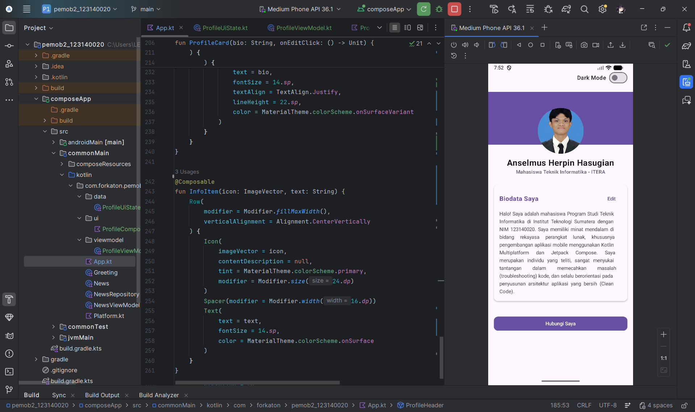
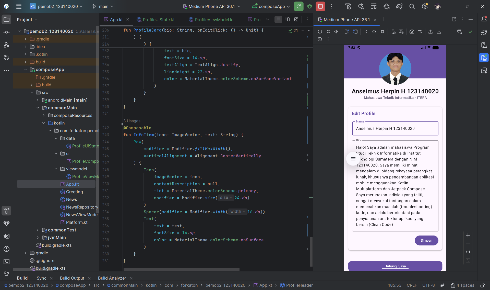
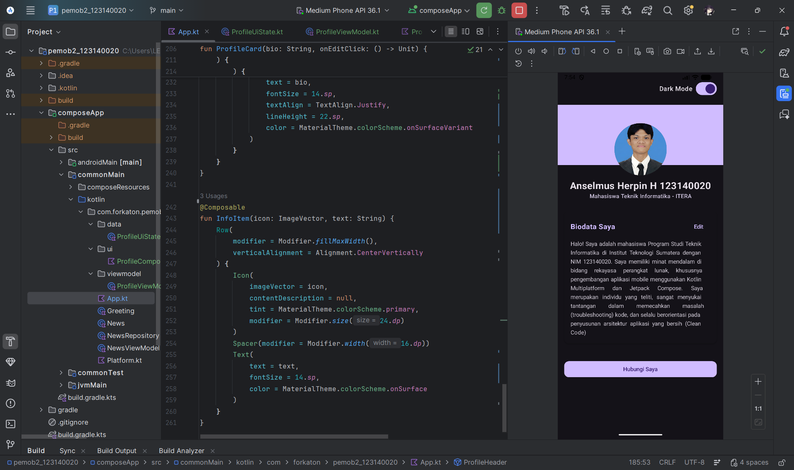

# Tugas Praktikum 4 - My Profile App (State Management & MVVM)

**Nama:** Anselmus Herpin Hasugian  
**NIM:** 123140020

## Deskripsi Proyek
Proyek ini merupakan pengembangan lanjutan dari aplikasi "My Profile App" dengan mengimplementasikan arsitektur **MVVM (Model-View-ViewModel)** dan manajemen *State* yang reaktif. Aplikasi ini dibangun menggunakan Kotlin Multiplatform dan Jetpack Compose, berfokus pada pemisahan logika bisnis dari tampilan antarmuka (*UI Layer*).

## Pemenuhan Kriteria Rubrik Penilaian
Aplikasi ini telah memenuhi seluruh spesifikasi tugas yang diinstruksikan:

1. **ViewModel Implementation (25%)**
    * Menggunakan `ProfileViewModel` yang mewarisi `androidx.lifecycle.ViewModel` untuk mempertahankan data saat terjadi perubahan konfigurasi.
    * Menggunakan `MutableStateFlow` dan mengeksposnya sebagai `StateFlow` *read-only* ke UI.
2. **UI State Pattern (20%)**
    * Menggunakan *Data class* `ProfileUiState` untuk merangkum seluruh status layar secara terpusat (nama, bio, mode edit, dan mode gelap).
3. **State Hoisting (20%)**
    * Pemisahan komponen `LabeledTextField` menjadi fungsi yang sepenuhnya *stateless*. Fungsi ini hanya menerima nilai dan *callback* (`onValueChange`) dari *parent*, tanpa menyimpan *state* internal.
4. **Edit Feature (20%)**
    * Implementasi form fungsional yang memungkinkan pengguna mengubah nama dan bio.
    * Terintegrasi dengan tombol "Simpan" yang memicu pembaruan status langsung ke ViewModel, dilengkapi dengan transisi animasi layar (`Crossfade`).
5. **Code Structure (15%)**
    * Kode telah distrukturisasi dengan prinsip *Clean Code* ke dalam *package* yang terpisah sesuai fungsinya:
        * `data/` (Penyimpanan model UI State)
        * `viewmodel/` (Pengelola logika bisnis)
        * `ui/` (Komponen visual *reusable*)
6. **Bonus (+10%) - Smooth Dark Mode Theme**
    * Implementasi sakelar (*Switch*) *Dark Mode* yang *state*-nya dikendalikan dari ViewModel.
    * Pergantian tema yang mulus (*smooth*) berkat adaptasi dinamis menggunakan `MaterialTheme(colorScheme)`.

## Dokumentasi Visual

**1. Profile View (Default)** 

**2. Edit Form** 

**3. Dark Mode** 

*(Catatan: Gambar di atas mewakili state UI yang dikendalikan penuh oleh ViewModel).*

## Cara Menjalankan Aplikasi
**Menjalankan di Emulator/Perangkat Android:**
```shell
.\gradlew.bat :composeApp:assembleDebug